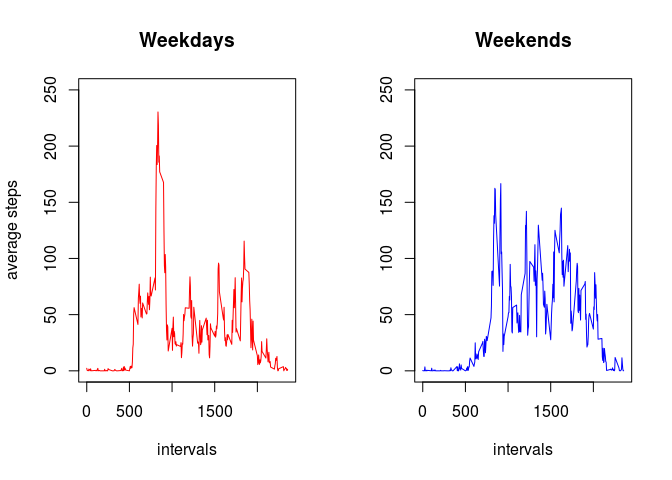

# Reproducible Research: Project 1

## Loading and preprocessing the data

```r
setwd("~/Documents/Reproducible Research/Project1/RepData_PeerAssessment1")
df <-read.csv("activity.csv")
```

## What is mean total number of steps taken per day?


```r
# 1. Make a histogram of the total number of steps taken each day
total.steps <- aggregate(df$steps, list(df$date), sum)
hist(total.steps$x, 40, xlab="total steps per day", main="distribution of Steps per Day",
     ylab="number of days")
```

 


```r
# 2. Calculate and report the mean and median total number of steps taken per day
mean_number_of_steps = as.integer(mean(total.steps$x, na.rm=T))
median_number_of_steps = median(total.steps$x, na.rm=T)
```

Average number of steps per day: 10766

Median number of steps per day: 10765

## What is the average daily activity pattern?


```r
# 1. Make a time series plot (i.e. type = "l") of the 5-minute interval (x-axis)
# and the average number of steps taken, averaged across all days (y-axis)
per.interval <- aggregate(df$steps, list(df$interval), mean, na.rm=T)
plot(per.interval$Group.1, per.interval$x, xlab="intervals", ylab="average steps",
     main="average Steps per Time Interval", type="l")
```

 


```r
# 2. Which 5-minute interval, on average across all the days in the dataset,
# contains the maximum number of steps?
max_interval <- which.max(per.interval$x)
```

Interval with Max Number of Steps: 104

## Imputing missing values


```r
# Note that there are a number of days/intervals where there are missing values
# (coded as NA). The presence of missing days may introduce bias into some
# calculations or summaries of the data.
# 1. Calculate and report the total number of missing values in the dataset
# (i.e. the total number of rows with NAs)
nmissing <- sum(is.na(df$steps))
```

Number of Missing Values: 2304


```r
# 2. Devise a strategy for filling in all of the missing values in the dataset. The
# strategy does not need to be sophisticated. For example, you could use
# the mean/median for that day, or the mean for that 5-minute interval, etc.
```

#### The mean steps for a given 5-minute interval seems like a reasonable value to use for replacing any NA values for that given interval.
#### This seems better than the mean for the given day, since the interval values seem to vary greatly throughout each day.


```r
# 3. Create a new dataset that is equal to the original dataset but with the
# missing data filled in.
for (i in 1:nrow(df)) { # TODO: can this be vectorized?
  if (is.na(df$steps[i])) { # replace NA value with mean for this interval
    df$steps[i] = per.interval$x[which(df$interval[i] == per.interval$Group.1)]
  }
}
# 4. Make a histogram of the total number of steps taken each day and Calculate
# and report the mean and median total number of steps taken per day. Do
# these values differ from the estimates from the first part of the assignment?
# What is the impact of imputing missing data on the estimates of the total
# daily number of steps?
total.steps <- aggregate(df$steps, list(df$date), sum)
hist(total.steps$x, 40, xlab="total steps per day", main="distribution of total Steps (Imputed)",
     ylab="number of days")
```

 

```r
mean_number_of_steps2 = as.integer(mean(total.steps$x))
median_number_of_steps2 = as.integer(median(total.steps$x))
```

Average steps per day (Imputed): 10766 (vs. 10766 NOT Imputed)

Median steps per day (Imputed): 10766 (vs. 10765 NOT Imputed)

## Are there differences in activity patterns between weekdays and weekends?


```r
# For this part the weekdays() function may be of some help here. Use the dataset
# with the filled-in missing values for this part.
# 1. Create a new factor variable in the dataset with two levels – “weekday”
# and “weekend” indicating whether a given date is a weekday or weekend
# day.
df$date <- as.Date(df$date) # convert to date structure
wkdys <- weekdays(df$date)
sat = wkdys == "Saturday"
sun = wkdys == "Sunday"
weekend = sat + sun
weekend = factor(weekend)

# 2. Make a panel plot containing a time series plot (i.e. type = "l") of the
# 5-minute interval (x-axis) and the average number of steps taken, averaged
# across all weekday days or weekend days (y-axis). The plot should look
# something like the following, which was creating using simulated data:
dfwk = df[weekend == 0,] # data frame of weekday values only
dfwe = df[weekend == 1,] # data frame of weekend values only
par(mfrow=c(1,2))
per.interval <- aggregate(dfwk$steps, list(dfwk$interval), mean)
plot(per.interval$Group.1, per.interval$x, xlab="intervals", ylab="average steps",
     main="Weekdays", type="l", col="Red", ylim=c(0,250))
per.interval <- aggregate(dfwe$steps, list(dfwe$interval), mean)
plot(per.interval$Group.1, per.interval$x, xlab="intervals", ylab=NA,
     main="Weekends", type="l", col="Blue", ylim=c(0,250))
```

 
